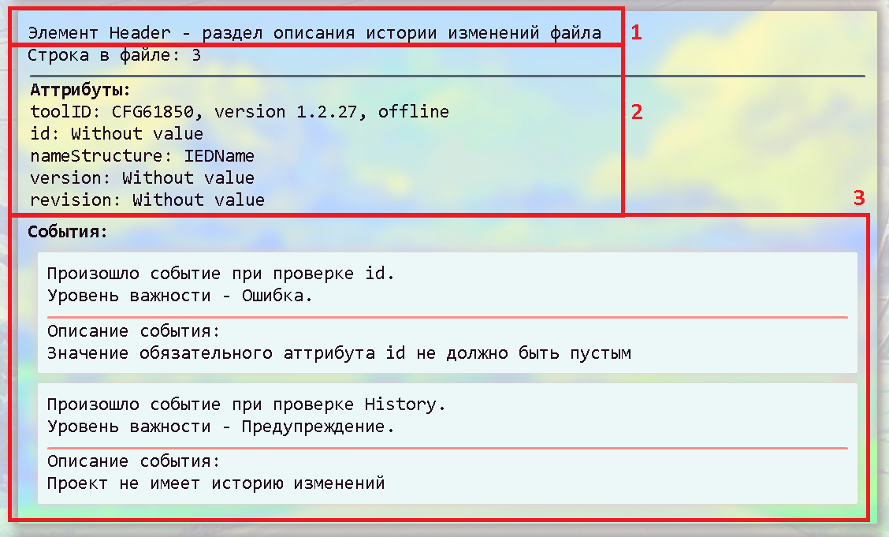

  

 
> Analyze your project on SCL with Solar.

## Introduction

Solar (pronounced [soˈlaɾ]) - это программа предназначенная для анализа SCL-файлов

## Функции

1. Контроль изменений версий электронного проекта;
2. Анализ файла описания конфигурации SCD на соответствие редакции стандарта МЭК61850;
3. Просмотр статистики о количестве устройств, типах сообщений, наборах данных и т. д.;
4. Расчет нагрузки на ЛВС;
5. Ведение лога ошибок, экспорт лога в Excel.

## Формат отображения результатов анализа

Результат анализа SCL-файла предоставляет пользователю возможность просмотра сообщений о валидации (верификации) SCD-файла и состоит из трех частей:
1. Описание раздела(элемента) файла, где зафиксировано событие. Например, IED, DOI, SampledValueControl или ConnectedAP
2. Описание параметров события таких, как:  
   * строка в файле, на которое ссылается анализатор. Это сделано для удобства, так как зачастую в файле присутствует много похожих элементов и единственный способ их различать это знать местоположение в файле
   * атрибуты файла. В данной области описывается свойства файла.
3. Описание событий элемента. В этой области описывается уровень важности события, приводится описание события, фиксируется уровень важности события, а также рекомендации, если Solar может их предоставить.

  

## О событиях при анализе

Solar разделяет события анализа на 4 группы по степени критической важности:
* Status
* Warning
* Error
* Fatal Error

## Usage

Solar представляет результаты анализа SCD-файла в виде представленных ниже основных этапов:
* [СП События первичной обработки файла](#СП-Cобытия-первичной-обработки-файла)
* [СО Синтаксические ошибки при сопоставлении с описанием структуры языка SCL](#СО-Синтаксические-ошибки-при-сопоставлении-с-описанием-структуры-языка-SCL)  
* [МД Анализ описания моделей данных ИЭУ](#МД-Анализ-описания-моделей-данных-ИЭУ)
* [ВС Анализ взаимосвязей сигналов ИЭУ](#ВС-Анализ-взаимосвязей-сигналов-ИЭУ)
* [НД Анализ наборов данных](#НД-Анализ-наборов-данных)
* [ОК Описание коммуникаций](#ОК-Описание-коммуникаций)
* [РН Анализ распределения нагрузки на виртуальные подсети](#РН-Анализ-распределения-нагрузки-на-виртуальные-подсети)
* [ОЛС Анализ раздела описания однолинейной схемы](#ОЛС-Анализ-раздела-описания-однолинейной-схемы)
* [ОТД Анализ описания типов данных](#ОТД-Анализ-описания-типов-данных)
* [ИФ Анализ описания истории изменений файла](#ИФ-Анализ-описания-истории-изменений-файла)

## СП Cобытия первичной обработки файла
К событиям первичной обработки файлов относятся те, которые Solar связывает с событиями, связанными с подготовкой файла к анализу.

Таблица 1 - Перечень событий, относящихся к первичной обработке файла

| № п/п | Описание события                                                       | Группа сигнала |
|-------|------------------------------------------------------------------------|----------------|
| 1.    | Проверяемый файл не удалось обработать                                 | F              |
| 2.    | Проверяемый файл - пустой или не существует                            | F              |

## СО Синтаксические ошибки при сопоставлении с описанием структуры языка SCL
Solar распознает синтаксис и структуру языка SCL и выполняет синтаксический анализ. Подробное описание в W3C XML Schema Definition Language (XSDL) 1.1.

## МД Анализ описания моделей данных ИЭУ
Solar выполняет проверки, связанные с правильностью построения модели данных ИЭУ, а также проверку в ИЭУ-издателе списков подписчиков на GOOSE/SV.

Таблица 2 – Перечень событий анализа описаний моделей данных ИЭУ(IED)

| № п/п | Описание события                                                                                                                                                                                                | Группа сигнала                                         |
|-------|-----------------------------------------------------------------------------------------------------------------------------------------------------------------------------------------------------------------|--------------------------------------------------------|
| 1.    | SCL-файл не содержит IEDList                                                                                                                                                                                  | F                                                      |
| 2.    | Элементы IED не уникальны по атрибуту name                                                                                                                                                                      | E                                                      |
| 3.    | В проекте содержится только одно ИЭУ. Проверка используемости элементов наборов данных GOOSE и(или) SV производиться не будет                                                                                 | S                                                      |
| 4.    | В проекте содержится {n} ИЭУ                                                                                                                                                                                  | S                                                      |
| 5.    | Элементы GSEControl и SampledValuesControl не уникальны по атрибуту smvID or goID во всем проекте                                                                                                               | E                                                      |
| 6.    | Элементы GSEControl и SampledValuesControl: ”Значение атрибута name содержит ссылку, которую невозможно проследить”                                                                                               | E                                                      |
| 7.    | Выявлены ошибки, связанные с ограничениями, наложенными на атрибуты элементов IED                                                                                                                               | E                                                      |
| 8.    | Выявлены ошибки, связанные с ограничениями, наложенными на атрибуты элементов KDC                                                                                                                               | E                                                      |
| 9.    | Элементы AccessPoint в пределах одного элемента IED не уникальны по атрибуту name                                                                                                                               | E                                                      |
| 10.   | Выявлены ошибки, связанные с ограничениями, наложенными на атрибуты элементов AccessPoint                                                                                                                       | E                                                      |
| 11.   | Внутри элемента AccessPoint содержится больше одного элемента (Server, ServerAt и LNList). Только одному из элементов (Server, ServerAt и LNList) разрешено одновременно находиться внутри элемента AccessPoint| E                                                      |
| 12.   | В элементе AccessPoint элементы LN не уникальны по комбинации атрибутов inst, lnClass, prefix                                                                                                                   | E                                                      |
| 13.   | Выявлены ошибки, связанные с ограничениями, наложенными на атрибуты элементов ServerAt                                                                                                                          | E                                                      |
| 14.   | Элементы ServerAt: ”Значение атрибута apName содержит ссылку, которую невозможно проследить”                                                                                                                      | E                                                      |
| 15.   | Выявлены ошибки, связанные с ограничениями, наложенными на атрибуты элементов Server                                                                                                                            | E                                                      |
| 16.   | В элементе Server отсутствует обязательный элемент Authentication                                                                                                                                               | E                                                      |
| 17.   | Элементы Association не уникальны по атрибуту associationID                                                                                                                                                     | E                                                      |
| 18.   | В элементе Server должен присутствовать хотя бы один обязательный элемент LDevice                                                                                                                               | E                                                      |
| 19.   | В элементе IED все элементы LDevice должны быть уникальны по атрибуту inst                                                                                                                                      | E                                                      |
| 20.   | Выявлены ошибки, связанные с ограничениями, наложенными на атрибуты элементов LDevice, Authetication и Assotiations                                                                                             | E                                                      |
| 21.   | В элементе LDevice элементы LN не уникальны по комбинации атрибутов inst, lnClass, prefix                                                                                                                       | E                                                      |
| 22.   | Элемент LDevice должен содержать обязательный логический узел LN0                                                                                                                                               | E                                                      |
| 23.   | Выявлены ошибки, связанные с ограничениями, наложенными на атрибуты элементов LN                                                                                                                                | E                                                      |
| 24.   | Атрибут inst в LN0 пропущен                                                                                                                                                                                     | E                                                      |
| 25.   | Значение атрибута inst в элементе LN0 должно содержать пустую строку                                                                                                                                            | E                                                      |
| 26.   | В элементе LN0 элементы GSEControl не уникальны по атрибуту name                                                                                                                                                | E                                                      |
| 27.   | В элементе LN0 элементы SampledValuesControl не уникальны по атрибуту name                                                                                                                                      | E                                                      |
| 28.   | В элементе LN0 элементы ReportControl не уникальны по атрибуту name                                                                                                                                             | E                                                      |
| 29.   | В элементе LN0 элементы LogControl не уникальны по атрибуту name                                                                                                                                                | E                                                      |
| 30.   | Элементы LogControl: ”Значение атрибута logName содержит ссылку, которую невозможно проследить”                                                                                                                   | E                                                      |
| 31.   | В элементе LN0 элементы Log не уникальны по атрибуту name, исключая элемент с не сконфигурированным атрибутом name                                                                                              | E                                                      |
| 32.   | В элементе LN0 элементы DOI не уникальны по атрибуту name                                                                                                                                                       | E                                                      |
| 33.   | В элементе LN0 элементы DataSet не уникальны по атрибуту name                                                                                                                                                   | E                                                      |
| 34.   | Элементы GSEControl, SampledValuesControl, LogControl и ReportControl: ”Значение атрибута datSet содержит ссылку, которую невозможно проследить”                                                                  | E                                                      |
| 35.   | Элементы GSEControl: ”Атрибут confRev должен присутствовать, когда атрибут type содержит значение GOOSE”                                                                                                          | E                                                      |
| 36.   | Элементы IEDName в элементах GSEControl и SampledValuesControl: ”Значение атрибута value содержит ссылку, которую невозможно проследить”                                                                          | E                                                      |
| 37.   | Выявлены ошибки, связанные с ограничениями, наложенными на атрибуты элементов GSECоntrol                                                                                                                        | E                                                      |
| 38.   | Проверка элементов SmvOpts и Protocol в SampledValuesControl и проверка ограничений, наложенных на их атрибуты                                                                                                  | E                                                      |
| 39.   | Выявлены ошибки, связанные с ограничениями, наложенными на атрибуты элементов SampledValuesControl                                                                                                              | E                                                      |
| 40.   | Выявлены ошибки, связанные с ограничениями, наложенными на атрибуты элементов SettingsControl                                                                                                                   | E                                                      |
| 41.   | Выявлены ошибки, связанные с ограничениями, наложенными на атрибуты элементов ReportControl                                                                                                                     | E                                                      |
| 42.   | Проверка элементов OptFields, RptEnabled и TrgOpts в ReportControl и проверка ограничений, наложенных на их атрибуты                                                                                            | E                                                      |
| 43.   | Выявлены ошибки, связанные с ограничениями, наложенными на атрибуты элементов ClientLN                                                                                                                          | E                                                      |
| 44.   | Выявлены ошибки, связанные с ограничениями, наложенными на атрибуты элементов LogControl                                                                                                                        | E                                                      |
| 45.   | Проверка элементов TrgOpts в LogControl и проверка ограничений, наложенных на их атрибуты                                                                                                                       | E                                                      |
| 46.   | Выявлены ошибки, связанные с ограничениями, наложенными на атрибуты элементов Log                                                                                                                               | E                                                      |
| 47.   | Выявлены ошибки, связанные с ограничениями, наложенными на атрибуты элементов DOI                                                                                                                               | E                                                      |
| 48.   | Элементы DAI и SDI внутри элемента DOI не уникальны по комбинации атрибутов name и ix                                                                                                                           | E                                                      |
| 49.   | Выявлены ошибки, связанные с ограничениями, наложенными на атрибуты элементов DAI                                                                                                                               | E                                                      |
| 50.   | Выявлены ошибки, связанные с ограничениями, наложенными на атрибуты элементов Val                                                                                                                               | E                                                      |
| 51.   | Выявлены ошибки, связанные с ограничениями, наложенными на атрибуты элементов SDI                                                                                                                               | E                                                      |
| 52.   | Элементы DAI и SDI внутри элемента SDI не уникальны по комбинации атрибутов name и ix                                                                                                                           | E                                                      |
| 53.   | Элементы LN: ”Количество элементов DOI в LN больше описанного в LNodeType”                                                                                                                                        | E                                                      |
| 54.   | Элементы LN: ”DOI с именем {name} не определен в LNodeType {id}”                                                                                                                                                  | E                                                      |
| 55.   | Элементы LN: ”Значение атрибута lnType содержит значение, не ссылающееся ни на один из LNodeType.id”                                                                                                              | E                                                      |
| 56.   | Элементы DOI: ”Количество SDI не совпадает с описанным в DOType”                                                                                                                                                  | E                                                      |
| 57.   | Элементы DOI: ”SDI с именем {name} не содержится в DOType {id}”                                                                                                                                                   | E                                                      |
| 58.   | Элементы SDI: ”Количество SDI не совпадает со списком BDA описанным в DAType”                                                                                                                                     | E                                                      |
| 59.   | Элементы SDI: ”SDI с именем {name} не содержится в DAType {id}”                                                                                                                                                   | E                                                      |
| 60.   | Элементы DOI(SDI): ”Количество DAI не совпадает с описанным в DOType”                                                                                                                                             | E                                                      |
| 61.   | Элементы DOI(SDI): ”DAI с именем {name} не содержится в DOType {id}”                                                                                                                                              | E                                                      |
| 62.   | В элементе LN элементы ReportControl не уникальны по атрибуту name                                                                                                                                              | E                                                      |
| 63.   | В элементе LN элементы LogControl не уникальны по атрибуту name                                                                                                                                                 | E                                                      |
| 64.   | В элементе LN элементы Log не уникальны по атрибуту name, исключая элемент с не сконфигурированным атрибутом name                                                                                               | E                                                      |
| 65.   | В элементе LN элементы DOI не уникальны по атрибуту name                                                                                                                                                        | E                                                      |
| 66.   | В элементе LN элементы DataSet не уникальны по атрибуту name                                                                                                                                                    | E                                                      |

## ВС Анализ взаимосвязей сигналов ИЭУ
ИЭУ обмениваются информацией посредством подписки на сигналы в других ИЭУ. Solar проверяет корректность этих подписок, выявляя несуществующие или некорректные подписки

Таблица 3 – Перечень событий по анализу взаимосвязей сигналов ИЭУ

| № п/п | Описание события                                                                                                                                                                                                                                                                                                                                            | Группа сигнала |
|-------|-------------------------------------------------------------------------------------------------------------------------------------------------------------------------------------------------------------------------------------------------------------------------------------------------------------------------------------------------------------|----------------|
| 1.    | Элемент Inputs, если присутствует, должен содержать элементы ExtRef                                                                                                                                                                                                                                                                                         | F              |
| 2.    | Выявлены ошибки, связанные с ограничениями, наложенными на атрибуты элементов ExtRef                                                                                                                                                                                                                                                                        | E              |
| 3.    | Для атрибутов srcLDInst, srcLNInst, srcLNClass, srcPrefix: ”Атрибут должен быть не сконфигурирован, так как атрибут srcCBName не сконфигурирован”                                                                                                                                                                                                             | E              |
| 4.    | Проверка наличия данных в наборе данных ИЭУ-издателя производиться не будет из-за отсутствия готовности потока данных dataflow (атрибуты iedName, ldInst, prefix, lnClass, lnInst, doName, srcCBName, daName) не правильно сконфигурирован (значения этих аттрибута(ов) не правильно сконфигурирован(ы)). Обратите внимание на другие ошибки этого элемента | S              |
| 5.    | ИЭУ {iedName} не найдено, возможно в атрибуте iedName содержится некорректное значение или список ИЭУ не содержит ИЭУ с таким именем, дальнейшая проверка этого элемента не возможна                                                                                                                                                            | E              |
| 6.    | Найдено более одного ИЭУ с именем {iedName}, дальнейшая проверка этого элемента не возможна                                                                                                                                                                                                                                                                 | E              |
| 7.    | ИЭУ-издатель не содержит элемент LDevice со значением {ldInst} в атрибуте inst, дальнейшая проверка этого элемента ExtRef не возможна                                                                                                                                                                                                                      | E              |
| 8.    | В ИЭУ-издателе найдено более одного элемента LDevice со значением {ldInst} в атрибуте inst, дальнейшая проверка этого элемента не возможна                                                                                                                                                                                                                 | E              |
| 9.    | Издатель содержит в элементе LDevice более одного или ни одного элемента LN с параметрами, указанными в элементе ExtRef                                                                                                                                                                                                                                     | E              |
| 10.   | По указанным в элементе ExtRef параметрам в LDevice издателя найдено более одного или ни одного блока управления                                                                                                                                                                                                                                            | E              |
| 11.   | Значение атрибута serviceType не корректно, должно быть одним из следующих: {Report/GOOSE/SMV}, Poll или аттрибут не должен присутствовать                                                                                                                                                                                                                  | E              |
| 12.   | Значение атрибута srcCBName содержит ссылку на блок управления, набор данных которого не сконфигурирован, дальнейшая проверка этого элемента не возможна                                                                                                                                                                                              | E              |
| 13.   | Значение атрибута srcCBName содержит ссылку на блок управления, набор данных которого не существует, дальнейшая проверка этого элемента не возможна                                                                                                                                                                                                         | E              |
| 14.   | Значение атрибута srcCBName содержит ссылку на блок управления, набор данных которого имеет не уникальное имя, дальнейшая проверка этого элемента не возможна                                                                                                                                                                                               | E              |
| 15.   | Ошибочная подписка. Набор данных не содержит объекты/атрибуты данных {iedName}.{ldInst}.{prefix}{lnClass}{lnInst}.{dataObjectAndAttribute}                                                                                                                                                                                                                  | E              | 
| 16.   | Блок управления содержит в своем наборе данных более одной записи о следующих данных: {iedName}.{ldInst}.{prefix}{lnClass}{lnInst}.{dataObjectAndAttribute}, повторяющиеся записи следует удалить                                                                                                                                                           | E              |

## НД Анализ наборов данных
Solar определяет наличие элементов набора данных в модели данных устройства. Также Solar проверяет подписано ли хоть одно ИЭУ на элементы набора данных

Таблица 4 – Перечень событий, относящихся к наборам данных

| № п/п | Описание события                                                                                                                                    | Группа сигнала |
|-------|-----------------------------------------------------------------------------------------------------------------------------------------------------|----------------|
| 1.    | Выявлены ошибки, связанные с ограничениями, наложенными на атрибуты элементов DataSet                                                               | E              |
| 2.    | Набор данных должен содержать хотя бы один элемент данных                                                                                           | F              |
| 3.    | Выявлены ошибки, связанные с ограничениями, наложенными на атрибуты элементов FCDA                                                                  | E              |
| 4.    | Элемент набора данных не используется. Среди подписчиков GOOSE или SV не найдено устройств принимающих этот элемент набора данных                   | Е              |
| 5.    | Значение атрибута ldInst содержит ссылку, которую невозможно проследить                                                                             | E              |
| 6.    | Атрибуты prefix, lnClass and lnInst содержат ссылку, которую невозможно проследить                                                                  | E              |
| 7.    | В описании типов логических узлов не удалось найти элемент DO со значением {do} в атрибуте name                                                     | E              |
| 8.    | Значение атрибута fc не удалось сопоставить со значением из описания типов логических узлов                                                         | E              |
| 9.    | В описании типов логических узлов не удалось найти элемент DA со значением {da} в атрибуте name                                                     | E              |
| 10.   | В описании типов логических узлов не удалось найти элемент DA, который не содержит вложенных объектов и со значением {da} в атрибуте name           | E              |
| 11.   | В элементе DataSet элементы FCDA с готовым dataflow (ldInst, prefix, lnClass, lnInst, doName, daName) не уникальны по комбинации атрибутов dataFlow | E              |

## ОК Описание коммуникаций
Для раздела описания коммуникаций Solar выполняет проверки, включая корректность L2 и L3 параметров.

Таблица 5 – Перечень событий, относящихся к коммуникациям

| № п/п | Описание события                                                                                                                                                                                                                                                                                                                              | Группа сигнала |
|-------|-----------------------------------------------------------------------------------------------------------------------------------------------------------------------------------------------------------------------------------------------------------------------------------------------------------------------------------------------|----------------|
| 1.    | SCL-файл не содержит раздел Communication                                                                                                                                                                                                                                                                                                     | F              |
| 2.    | Выявлены ошибки, связанные с ограничениями, наложенными на атрибуты элементов SubNetwork                                                                                                                                                                                                                                                      | E              |
| 3.    | Элемент Communication должен содержать хотя бы один элемент SubNetwork                                                                                                                                                                                                                                                                        | F              |
| 4.    | Элементы Subnetwork не уникальны по атрибуту name                                                                                                                                                                                                                                                                                             | E              |
| 5.    | Выявлены ошибки, связанные с ограничениями, наложенными на атрибуты элементов BitRate                                                                                                                                                                                                                                                         | E              |
| 6.    | Выявлены ошибки, связанные с ограничениями, наложенными на атрибуты элементов ConnectedAP                                                                                                                                                                                                                                                     | E              |
| 7.    | В сети не описано ни одной точки доступа (ConnectedAP)                                                                                                                                                                                                                                                                                        | E              |
| 8.    | В элементе Subnetwork элементы ConnectedAP не уникальны по комбинации атрибутов apName и iedName                                                                                                                                                                                                                                              | E              |
| 9.    | Значение атрибута iedName в элементе ConnectedAP содержит ссылку, которую невозможно проследить.                                                                                                                                                                                                                                              | E              |
| 10.   | Значение атрибута apName в элементе ConnectedAP содержит ссылку, которую невозможно проследить.                                                                                                                                                                                                                                               | E              |
| 11.   | Элемент Address не сконфигурирован, родительский элемент ConnectedAP не имеет сетевых параметров                                                                                                                                                                                                                                              | F              |
| 12.   | В элементе ConnectedAP не найдено сетевых настроек                                                                                                                                                                                                                                                                                            | F              |
| 13.   | Выявлены ошибки, связанные с ограничениями, наложенными на атрибуты элементов P                                                                                                                                                                                                                                                               | E              |
| 14.   | Маска подсети не сконфигурирована                                                                                                                                                                                                                                                                                                             | E              |
| 15.   | Нули и единицы в маске подсети не могут чередоваться                                                                                                                                                                                                                                                                                          | E              |
| 16.   | Основной шлюз (Gateway) не сконфигурирован                                                                                                                                                                                                                                                                                                    | E              |
| 17.   | Основной шлюз (Gateway) имеет значение 0.0.0.0 (Routing to black hole)                                                                                                                                                                                                                                                                        | W              |
| 18.   | IP-адрес имеет значение 0.0.0.0 или не сконфигурирован                                                                                                                                                                                                                                                                                        | E              |
| 19.   | IP-адрес и основной шлюз (Gateway) шлюз/маска находятся в разных подсетях                                                                                                                                                                                                                                                                     | E              |
| 20.   | IP-адрес совпадает с адресом подсети                                                                                                                                                                                                                                                                                                          | W              |
| 21.   | IP-адрес совпадает с широковещательным адресом подсети                                                                                                                                                                                                                                                                                        | W              |
| 22.   | В элементе Subnetwork элементы ConnectedAP не уникальны по ip- адресу                                                                                                                                                                                                                                                                         | E              |
| 23.   | Элемент ConnectedAP не содержит ни одного элемента GSE или SMV (блоки управления GOOSE или SV)                                                                                                                                                                                                                                                | W              |
| 24.   | Выявлены ошибки, связанные с ограничениями, наложенными на атрибуты элементов GSE                                                                                                                                                                                                                                                             | E              |
| 25.   | Выявлены ошибки, связанные с ограничениями, наложенными на атрибуты элементов SMV                                                                                                                                                                                                                                                             | E              |
| 26.   | В элементе ConnectedAP элементы SMV и GSE не уникальны по комбинации атрибутов cbName и ldInst                                                                                                                                                                                                                                                | E              |
| 27.   | Значение атрибута ldinst содержит ссылку, которую невозможно проследить. Атрибут ldInst содержит ссылку на атрибут inst элемента LDevice, которую невозможно проследить, возможно родительский элемент ConnectedAP содержит некорректные значения iedName и(или) apName, или атрибут ldInst содержит некорректное значение                    | E              |
| 28.   | Значение атрибута cbName содержит ссылку, которую невозможно проследить. Невозможно проследить ссылку в элементе GSEControl\SampledValueControl на атрибут name, которого ссылается cbName, возможно родительский элемент ConnectedAP содержит некорректные значения iedName и(или) apName, или атрибут cbName содержит некорректное значение | E              |
| 29.   | Выявлены ошибки, связанные с ограничениями, наложенными на атрибуты элементов MinTime                                                                                                                                                                                                                                                         | E              |
| 30.   | Выявлены ошибки, связанные с ограничениями, наложенными на атрибуты элементов MaxTime                                                                                                                                                                                                                                                         | E              |
| 31.   | Элемент MinTime: ”Параметр не сконфигурирован, неизвестно с кокой минимальной частотой будет работать GOOSE рассылка”                                                                                                                                                                                                                           | F              |
| 32.   | Элемент MaxTime: ”Параметр не сконфигурирован, расчет нагрузки GOOSE(GSSE) рассылки на сеть не возможно провести”                                                                                                                                                                                                                               | F              |
| 33.   | Элемент Address не сконфигурирован, блок управления не имеет сетевых параметров                                                                                                                                                                                                                                                               | F              |
| 34.   | &quot;Сетевые параметры блока управления не сконфигурированы&quot;                                                                                                                                                                                                                                                                            | F              |
| 35.   | Значение MAC-адреса должно быть представлено в виде хх-хх-хх-хх- хх-хх, где х - это шестнадцатеричное число                                                                                                                                                                                                                                   | E              |
| 36.   | для GSE: ”MAC-адрес должен находиться в диапазоне 010ccd010000 - 010ccd0101ff”                                                                                                                                                                                                                                                                  | E              |
| 37.   | для SMV: ”MAC-адрес должен находиться в диапазоне 010ccd040000 - 010ccd0401ff”                                                                                                                                                                                                                                                                  | E              |
| 38.   | В элементе ConnectedAP элементы SMV(GSE) не уникальны по mac- адресу                                                                                                                                                                                                                                                                          | E              |
| 39.   | APPID должно быть шестнадцатеричным четырехразрядным числом                                                                                                                                                                                                                                                                                   | E              |
| 40.   | VLAN-ID должно быть шестнадцатеричным трех разрядным числом                                                                                                                                                                                                                                                                                   | E              |

## РН Анализ распределения нагрузки на виртуальные подсети
Solar вычисляет распределение GOOSE и SV в ЛВС, используя идентификатор VLAN-ID. Выдается сводная статистика по всем VLAN’ам, отображая разбивку GOOSE и SV по VLAN’ам.

Таблица 6 – Перечень событий, относящихся к виртуальным сетям

| № п/п | Описание события                                                                                                                                                                                                                                   | Группа сигнала |
|-------|----------------------------------------------------------------------------------------------------------------------------------------------------------------------------------------------------------------------------------------------------|----------------|
| 1.    | Не удалось найти в описании подсетей описания сетевых параметров для данного SampledValueControl. Расчет нагрузки на ЛВС будет произведен без учета этого SV-потока                                                                                | F              |
| 2.    | Сетевые параметры блока управления не сконфигурированы. Расчет нагрузки на ЛВС будет произведен без учета этого {GOOSE/SV}                                                                                                                         | F              |
| 3.    | Не удалось определить VLAN, поэтому VLAN будет принят за первый (соответствует значению 001)                                                                                                                                                       | S              |
| 4.    | VLAN имеет некорректное значение, обратите внимание на другие ошибки, связанные с VLAN-ID. Расчет нагрузки на ЛВС будет произведен без учета этого {GOOSE/SV}                                                                                      | F              |
| 5.    | Не удалось найти в описании подсетей описания сетевых параметров для данного GSEControl. Расчет нагрузки на ЛВС будет произведен без учета этого GOOSE-сообщения                                                                                   | F              |
| 6.    | GOOSE-сообщение с некорректным временем Tmax не будет участвовать в расчете нагрузки на ЛВС                                                                                                                                                        | F              |
| 7.    | GOOSE-сообщение со временем Tmax равным 0 не будет участвовать в расчете нагрузки на ЛВС                                                                                                                                                           | F              |
| 8.    | DataFlow (атрибуты ldInst, prefix, lnClass, lnInst, doName, daName, fc) не полностью сконфигурирован или не сконфигурирован. При расчете нагрузки на ЛВС для этого элемента в наборе данных величина передаваемых по ЛВС данных будет принята за 0 | S              |
| 9.    | Не удалось найти указанный логический узел. При расчете нагрузки на ЛВС для этого элемента в наборе данных величина передаваемых по ЛВС данных будет принята за 0                                                                                  | F              |
| 10.   | Атрибут doName содержит значение, по которому не удалось найти DO в логическом узле {prefix}{lnClass}{lnInst}. При расчете нагрузки на ЛВС для этого элемента в наборе данных величина передаваемых по ЛВС данных будет принята за 0               | F              |
| 11.   | Не найдено ни одного атрибута данных с указанным fc. При расчете нагрузки на ЛВС для этого элемента в наборе данных величина передаваемых по ЛВС данных будет принята за 0                                                                         | F              |
| 12.   | В подсети содержится {n} VLAN&#39;ов с номерами: {список вланов}                                                                                                                                                                       | S              |
| 13.   | VLAN {id} пропускает через себя {число с тремя знаками после запятой} кбит/с данных. Через этот VLAN проходят: {sv[список sv] goose[список goose] }                                                                                    | E              |

## ОЛС Анализ раздела описания однолинейной схемы
Для однолинейных схем подстанций Solar проверяет корректность привязок логических узлов к первичному оборудованию. Осуществляется проверка правильности построения схемы.

Таблица 7 – Перечень событий, относящихся к описанию однолинейной схемы

| № п/п | Описание события                                                                                                                                                                                                                                                                                                                                                     | Группа сигнала |
|-------|----------------------------------------------------------------------------------------------------------------------------------------------------------------------------------------------------------------------------------------------------------------------------------------------------------------------------------------------------------------------|----------------|
| 1.    | Электронный проект не содержит описания однолинейных схем подстанций. Привязка функций логических узлов к первичному оборудования не будет проводиться                                                                                                                                                                                                               | S              |
| 2.    | В элементе SCL элементы Substation не уникальны по атрибуту name                                                                                                                                                                                                                                                                                                     | E              |
| 3.    | Выявлены ошибки, связанные с ограничениями, наложенными на атрибуты элементов Substation                                                                                                                                                                                                                                                                             | E              |
| 4.    | В элементе Substation элементы LNode не уникальны по комбинации атрибутов &quot;lnInst&quot;, &quot;lnClass&quot;, &quot;iedName&quot;, &quot;ldInst&quot;, &quot;prefix&quot;                                                                                                                                                                                       | E              |                                                                                                                                                                                      
| 5.    | Выявлены ошибки, связанные с ограничениями, наложенными на атрибуты элементов LNode                                                                                                                                                                                                                                                                                  | E              |
| 6.    | Проверка существования логического узла в ИЭУ производиться не будет т.к. поток данных (&quot;iedName&quot;, &quot;ldInst&quot;, &quot;prefix&quot;, &quot;lnClass&quot;, &quot;lnInst&quot;, &quot;lnType&quot;) неправильно сконфигурирован (значения атрибута(ов) не правильно сконфигурирован(ы)). Обратите внимание на другие ошибки этого элемента файла&quot; | S              |
| 7.    | ИЭУ {iedName} не найдено, возможно в атрибуте iedName содержится некорректное значение или список ИЭУ не содержит ИЭУ с таким именем, дальнейшая проверка этого элемента не возможна                                                                                                                                                                                 | E              |                                                                                                                                                                               
| 8.    | Найдено более одного ИЭУ с именем {iedName}, дальнейшая проверка этого элемента не возможна                                                                                                                                                                                                                                                                          | E              |                                                                                                                                                                                                                                                                        
| 9.    | ИЭУ не содержит элемент LDevice со значением {ldInst} в атрибуте inst, дальнейшая проверка этого элемента не возможна                                                                                                                                                                                                                                                | E              |                                                                                                                                                                                                                                               
| 10.   | В ИЭУ найдено более одного элемента LDevice со значением {ldInst} в аттрибуте inst, дальнейшая проверка этого элемента не возможна                                                                                                                                                                                                                                   | E              |                                                                                                                                                                                                                                   
| 11.   | ИЭУ в элементе LDevice содержит более одного или ни одного элемента LN с параметрами, указанными в элементе LNode                                                                                                                                                                                                                                             | E              |                                                                                                                                                                                                                                            
| 12.   | Выявлены ошибки, связанные с ограничениями, наложенными на атрибуты элементов GeneralEquipment                                                                                                                                                                                                                                                                       | E              |                                                                                                                                                                                                                                                                      
| 13.   | В элементе GeneralEquipment элементы LNode не уникальны по комбинации атрибутов &quot;lnInst&quot;, &quot;lnClass&quot;, &quot;iedName&quot;, &quot;ldInst&quot;, &quot;prefix&quot;                                                                                                                                                                                 | E              |                                                                                                                                                                              
| 14.   | В элементе GeneralEquipment элементы EqFunction не уникальны по атрибуту name                                                                                                                                                                                                                                                                                        | E              |                                                                                                                                                                                                                                                                                       
| 15.   | Выявлены ошибки, связанные с ограничениями, наложенными на атрибуты элементов EqFunction                                                                                                                                                                                                                                                                             | E              |                                                                                                                                                                                                                                                                         
| 16.   | В элементе EqFunction элементы LNode не уникальны по комбинации атрибутов &quot;lnInst&quot;, &quot;lnClass&quot;, &quot;iedName&quot;, &quot;ldInst&quot;, &quot;prefix&quot;                                                                                                                                                                                       | E              |                                                                                                                                                                                     
| 17.   | В элементе EqFunction элементы GeneralEquipment, EqSubFunction не уникальны по атрибуту name                                                                                                                                                                                                                                                                         | E              |                                                                                                                                                                                                                                                                        
| 18.   | Выявлены ошибки, связанные с ограничениями, наложенными на атрибуты элементов EqSubFunction                                                                                                                                                                                                                                                                          | E              |                                                                                                                                                                                                                                                                         
| 19.   | В элементе EqSubFunction элементы LNode не уникальны по комбинации атрибутов &quot;lnInst&quot;, &quot;lnClass&quot;, &quot;iedName&quot;, &quot;ldInst&quot;, &quot;prefix&quot;                                                                                                                                                                                    | E              |                                                                                                                                                                                   
| 20.   | В элементе EqSubFunction элементы GeneralEquipment, EqSubFunction не уникальны по атрибуту name                                                                                                                                                                                                                                                                      | E              |                                                                                                                                                                                                                                                                     
| 21.   | Выявлены ошибки, связанные с ограничениями, наложенными на атрибуты элементов PowerTransformer                                                                                                                                                                                                                                                                       | E              |                                                                                                                                                                                                                                                                     
| 22.   | В элементе PowerTransformer элементы LNode не уникальны по комбинации атрибутов &quot;lnInst&quot;, &quot;lnClass&quot;, &quot;iedName&quot;, &quot;ldInst&quot;, &quot;prefix&quot;                                                                                                                                                                                 | E              |                                                                                                                                                                            
| 23.   | Трансформатор должен содержать как минимум одну обмотку                                                                                                                                                                                                                                                                                                              | E              |                                                                                                                                                                                                                                                                                                            
| 24.   | Выявлены ошибки, связанные с ограничениями, наложенными на атрибуты элементов TransformerWinding                                                                                                                                                                                                                                                                     | E              |                                                                                                                                                                                                                                                                     
| 25.   | В элементе PowerTransformer элементы TransformerWinding, SubEquipment, EqFunction не уникальны по атрибуту name                                                                                                                                                                                                                                                      | E              |                                                                                                                                                                                                                                                 
| 26.   | Выявлены ошибки, связанные с ограничениями, наложенными на атрибуты элементов TapChanger                                                                                                                                                                                                                                                                             | E              |                                                                                                                                                                                                                                                                            
| 27.   | Выявлены ошибки, связанные с ограничениями, наложенными на атрибуты элементов NeutralPoint                                                                                                                                                                                                                                                                           | E              |                                                                                                                                                                                                                                                                         
| 28.   | Выявлены ошибки, связанные с ограничениями, наложенными на атрибуты элементов SubEquipment                                                                                                                                                                                                                                                                           | E              |                                                                                                                                                                                                                                                                          
| 29.   | В элементе SubEquipment элементы LNode не уникальны по комбинации атрибутов &quot;lnInst&quot;, &quot;lnClass&quot;, &quot;iedName&quot;, &quot;ldInst&quot;, &quot;prefix&quot;                                                                                                                                                                                     | E              |                                                                                                                                                                                  
| 30.   | В элементе SubEquipment элементы EqFunctions не уникальны по атрибуту name                                                                                                                                                                                                                                                                                           | E              |                                                                                                                                                                                                                                                                                           
| 31.   | Описание однолинейной схемы подстанции должно содержать хотя бы один уровень напряжения                                                                                                                                                                                                                                                                              | E              |
| 32.   | Выявлены ошибки, связанные с ограничениями, наложенными на атрибуты элементов Function                                                                                                                                                                                                                                                                               | E              |                                                                                                                                                                                                                                                                             
| 33.   | Выявлены ошибки, связанные с ограничениями, наложенными на атрибуты элементов VoltageLevel                                                                                                                                                                                                                                                                           | E              |                                                                                                                                                                                                                                                                        
| 34.   | В элементе Substation элементы PowerTransformers, GeneralEquipment, Function, VoltageLevel не уникальны по атрибуту name                                                                                                                                                                                                                                             | E              |
| 35.   | В элементе Function элементы LNode не уникальны по комбинации атрибутов &quot;lnInst&quot;, &quot;lnClass&quot;, &quot;iedName&quot;, &quot;ldInst&quot;, &quot;prefix&quot;                                                                                                                                                                                         | E              |
| 36.   | Выявлены ошибки, связанные с ограничениями, наложенными на атрибуты элементов ConductingEquipment                                                                                                                                                                                                                                                                    | E              |
| 37.   | Выявлены ошибки, связанные с ограничениями, наложенными на атрибуты элементов SubFunction                                                                                                                                                                                                                                                                            | E              |
| 38.   | В элементе Function элементы GeneralEquipment, SubFunction, ConductingEquipment не уникальны по атрибуту name                                                                                                                                                                                                                                                        | E              |
| 39.   | В элементе SubFunction элементы LNode не уникальны по комбинации атрибутов &quot;lnInst&quot;, &quot;lnClass&quot;, &quot;iedName&quot;, &quot;ldInst&quot;, &quot;prefix&quot;                                                                                                                                                                                      | E              |
| 40.   | В элементе SubFunction элементы GeneralEquipment, SubFunction, ConductingEquipment не уникальны по атрибуту name                                                                                                                                                                                                                                                     | E              |                                                                                                                                                                                                                                                   
| 41.   | В элементе ConductingEquipment элементы LNode не уникальны по комбинации атрибутов &quot;lnInst&quot;, &quot;lnClass&quot;, &quot;iedName&quot;, &quot;ldInst&quot;, &quot;prefix&quot;                                                                                                                                                                              | E              |
| 42.   | Выявлены ошибки, связанные с ограничениями, наложенными на атрибуты элементов Terminal                                                                                                                                                                                                                                                                               | E              |
| 43.   | В элементе ConductingEquipment элементы SubEquipment, EqFunction не уникальны по атрибуту name                                                                                                                                                                                                                                                                       | E              |
| 44.   | Выключатель должен иметь 2 точки подключения на однолинейной схеме                                                                                                                                                                                                                                                                                                   | E              |
| 45.   | Разъединитель (Заземляющий нож) должен иметь 2 точки подключения на однолинейной схеме                                                                                                                                                                                                                                                                               | E              |
| 46.   | Трансформатор напряжения должен иметь 1 точку подключения на однолинейной схеме                                                                                                                                                                                                                                                                                      | E              |
| 47.   | Трансформатор тока должен иметь 2 точки подключения на однолинейной схеме                                                                                                                                                                                                                                                                                            | E              |
| 48.   | Генератор должен иметь 1 точку подключения на однолинейной схеме                                                                                                                                                                                                                                                                                                     | E              |
| 49.   | Батарея конденсаторов должна иметь 1 точку подключения на однолинейной схеме                                                                                                                                                                                                                                                                                         | E              |
| 50.   | Преобразователь должен иметь 1 точку подключения на однолинейной схеме                                                                                                                                                                                                                                                                                               | E              |
| 51.   | Двигатель должен иметь 1 точку подключения на однолинейной схеме                                                                                                                                                                                                                                                                                                     | E              |
| 52.   | Вентилятор должен иметь 1 точку подключения на однолинейной схеме                                                                                                                                                                                                                                                                                                    | E              |
| 53.   | Насос должен иметь 1 точку подключения на однолинейной схеме                                                                                                                                                                                                                                                                                                         | E              |
| 54.   | Дугогасительная катушка должна иметь 1 точку подключения на однолинейной схеме                                                                                                                                                                                                                                                                                       | E              |
| 55.   | Силовой шунт должен иметь 2 точки подключения на однолинейной схеме                                                                                                                                                                                                                                                                                                  | E              |
| 56.   | Аккумуляторная батарея должен иметь 1 точку подключения на однолинейной схеме                                                                                                                                                                                                                                                                                        | E              |
| 57.   | Высоковольтный ввод должен иметь 2 точки подключения на однолинейной схеме                                                                                                                                                                                                                                                                                           | E              |
| 58.   | Силовой кабель должен иметь 2 точки подключения на однолинейной схеме                                                                                                                                                                                                                                                                                                | E              |
| 59.   | Линия с элегазовой изоляцией должна иметь 2 точки подключения на однолинейной схеме                                                                                                                                                                                                                                                                                  | E              |
| 60.   | Воздушная линия должна иметь 2 точки подключения на однолинейной схеме                                                                                                                                                                                                                                                                                               | E              |
| 61.   | Резистор цепи заземления нейтрали должен иметь 2 точки подключения на однолинейной схеме                                                                                                                                                                                                                                                                             | E              |
| 62.   | Вращающийся реактивный элемент должен иметь 1 точку подключения на однолинейной схеме                                                                                                                                                                                                                                                                                | E              |
| 63.   | Разрядник должен иметь 1 точку подключения на однолинейной схеме                                                                                                                                                                                                                                                                                                     | E              |
| 64.   | Полупроводниковый выпрямитель с управляющим выводом должен иметь 2 точки подключения на однолинейной схеме                                                                                                                                                                                                                                                           | E              |
| 65.   | Синхронный двигатель должен иметь 1 точку подключения на однолинейной схеме                                                                                                                                                                                                                                                                                          | E              |
| 66.   | Тиристорный преобразователь частоты должен иметь 2 точки подключения на однолинейной схеме                                                                                                                                                                                                                                                                           | E              |
| 67.   | Тиристорный реактивный элемент должен иметь 2 точки подключения на однолинейной схеме                                                                                                                                                                                                                                                                                | E              |
| 68.   | Питающая(отходящая) линия должна иметь 1 точку подключения на однолинейной схеме                                                                                                                                                                                                                                                                                     | E              |
| 69.   | Для элемента Terminal: &quot;Значение атрибута substationName содержит некорректное значение&quot;                                                                                                                                                                                                                                                                   | E              |
| 70.   | Для элемента Terminal: &quot;Значение атрибута voltageLevelName содержит некорректное значение&quot;                                                                                                                                                                                                                                                                 | E              |
| 71.   | Для элемента Terminal: &quot;Значение атрибута bayName содержит некорректное значение&quot;                                                                                                                                                                                                                                                                          | E              |
| 72.   | Для элемента Terminal: &quot;Значение атрибута cNodeName содержит некорректное значение&quot;                                                                                                                                                                                                                                                                        | E              |
| 73.   | Значение атрибута connectivityNode и значение атрибута pathName точки соединения не совпадают                                                                                                                                                                                                                                                                        | E              |
| 74.   | В элементе VoltageLevel элементы LNode не уникальны по комбинации атрибутов &quot;lnInst&quot;, &quot;lnClass&quot;, &quot;iedName&quot;, &quot;ldInst&quot;, &quot;prefix&quot;                                                                                                                                                                                     | E              |
| 75.   | Выявлены ошибки, связанные с ограничениями, наложенными на атрибуты элементов Voltage                                                                                                                                                                                                                                                                                | E              |
| 76.   | Выявлены ошибки, связанные с ограничениями, наложенными на атрибуты элементов Bay                                                                                                                                                                                                                                                                                    | E              |
| 77.   | В элементе Bay элементы LNode не уникальны по комбинации атрибутов &quot;lnInst&quot;, &quot;lnClass&quot;, &quot;iedName&quot;, &quot;ldInst&quot;, &quot;prefix&quot;                                                                                                                                                                                              | E              |
| 78.   | В элементе Bay элементы PowerTransformer, GeneralEquipment, Function, ConductingEquipment, ConnectivityNode не уникальны по атрибуту name                                                                                                                                                                                                                            | E              |
| 79.   | Уровни напряжения должны содержать как минимум одно присоединение                                                                                                                                                                                                                                                                                                    | E              |
| 80.   | В элементе VoltageLevel элементы PowerTransformer, GeneralEquipment, Function, Bay не уникальны по атрибуту name                                                                                                                                                                                                                                                     | E              |
| 81.   | Выявлены ошибки, связанные с ограничениями, наложенными на атрибуты элементов ConnectivityNode                                                                                                                                                                                                                                                                       | E              |
| 82.   | Значение атрибута pathName не соответствует действительному расположению точки соединения. Действительному расположению соответствует значение {effectivePath}                                                                                                                                                                                                       | E              |
| 83.   | В элементе ConnectivityNode элементы LNode не уникальны по комбинации атрибутов &quot;lnInst&quot;, &quot;lnClass&quot;, &quot;iedName&quot;, &quot;ldInst&quot;, &quot;prefix&quot;                                                                                                                                                                                 | E              |

## ОТД Анализ описания типов данных
Модели данных ИЭУ строятся по определенным правилам, определенным в разделе описания типов данных (DataTypeTemplates). Solar проверяет на корректность правила построения моделей данных ИЭУ.

Таблица 8 – Перечень событий, относящихся к описанию типов данных

| № п/п | Описание события                                                                                      | Группа сигнала |
|-------|-------------------------------------------------------------------------------------------------------|----------------|
| 1.    | SCL-файл не содержит DataTypeTemplates                                                               | F              |
| 2.    | Элемент DataTypeTemplates должен содержать хотя бы один тип логического узла (LNodeType)              | F              |
| 3.    | Элемент DataTypeTemplates должен содержать хотя бы один тип объекта данных (DOType)                   | F              |
| 4.    | В элементе DataTypeTemplates элементы LNodeType, DOType, DAType, EnumType не уникальны по атрибуту id | E              |
| 5.    | Проверка ограничений, наложенных на атрибуты элементов LNodeType                                      | E              |
| 6.    | Тип логического узла должен содержать объекты данных (DO)                                             | F              |
| 7.    | В элементе LNodeType элементы DO не уникальны по атрибуту name                                        | E              |
| 8.    | Выявлены ошибки, связанные с ограничениями, наложенными на атрибуты элементов DO                      | E              |
| 9.    | Для DO: Значение атрибута type содержит ссылку, которую невозможно проследить                         | E              |
| 10.   | Выявлены ошибки, связанные с ограничениями, наложенными на атрибуты элементов DOType                  | E              |
| 11.   | В элементе DOType элементы DA и SDO не уникальны по атрибуту name                                     | E              |
| 12.   | Выявлены ошибки, связанные с ограничениями, наложенными на атрибуты элементов DA                      | E              |
| 13.   | Для DA: Значение атрибута type содержит ссылку, которую невозможно проследить                         | E              |
| 14.   | Выявлены ошибки, связанные с ограничениями, наложенными на атрибуты элементов ProtNS                  | E              |
| 15.   | В элементе DA элементы ProtNS не уникальны по комбинации атрибутов type и value                       | E              |
| 16.   | Выявлены ошибки, связанные с ограничениями, наложенными на атрибуты элементов SDO                     | E              |
| 17.   | Для SDO: Значение атрибута type содержит ссылку, которую невозможно проследить                        | E              |
| 18.   | Выявлены ошибки, связанные с ограничениями, наложенными на атрибуты элементов DAType                  | E              |
| 19.   | Элемент тип сложного атрибута данных(DAType) должен содержать вложенные элементы BDA                  | F              |
| 20.   | В элементе DAType элементы ProtNS не уникальны по комбинации атрибутов type и value                   | E              |
| 21.   | Выявлены ошибки, связанные с ограничениями, наложенными на атрибуты элементов BDA                     | E              |
| 22.   | Для BDA: Значение атрибута type содержит ссылку, которую невозможно проследить                        | E              |
| 23.   | Выявлены ошибки, связанные с ограничениями, наложенными на атрибуты элементов Val                     | E              |
| 24.   | Выявлены ошибки, связанные с ограничениями, наложенными на атрибуты элементов EnumType                | E              |
| 25.   | Выявлены ошибки, связанные с ограничениями, наложенными на атрибуты элементов EnumVal                 | E              |
| 26.   | Список значений перечислимого типа не должен быть пустым                                              | F              |
| 27.   | В элементе EnumType элементы EnumVal не уникальны по комбинации атрибутов ord и value                 | E              |

## ИФ Анализ описания истории изменений файла
Solar проверяет в разделе Header информацию о последних изменениях в SCL-файле на корректность.

Таблица 9 – Перечень событий, относящихся к элементу &lt;Header&gt;

| № п/п | Описание события                                                                                       | Группа сигнала |
|-------|--------------------------------------------------------------------------------------------------------|----------------|
| 1.    | SCL-файл не содержит Header                                                                            | F              |
| 2.    | Выявлены ошибки, связанные с ограничениями, наложенными на атрибуты элемента Header                    | E              |
| 3.    | Значением атрибута nameStructure может быть только строкой IEDName, иначе атрибут должен отсутствовать | E              |
| 4.    | Проект не имеет историю изменений                                                                      | S              |
| 5.    | Элемент History должен содержать как минимум один элемент HItem                                        | F              |
| 6.    | В элементе History элементы HItem не уникальны по комбинации атрибутов version и revision              | E              |
| 7.    | Выявлены ошибки, связанные с ограничениями, наложенными на атрибуты элемента HItem                     | E              |